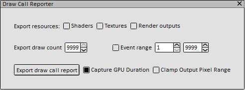

# Draw Call Report

## Introduction

`draw_call_report` is an extension to
1. Export pipeline info along with draw calls and compute dispatches to csv file.
2. Dump shaders, input textures and output render targets.

It supports both GLES and Vulkan captures. With `draw_call_report`, we could easily get an overview of render pass flow and input/output resources for each draw/compute action without waiting frame context switching during replay.

## Report Format

|Name|Description|
|-|-|
|Event ID|Action event id|
|Custom Name|Action annotation (ex. debug label from game engines)|
|Name|API name|
|Vertex Count|Drawn vertex count|
|Instance Count|Drawn instance count|
|Dispatch Dimension|Number of compute work groups in (X, Y, Z) dimension|
|GPU Duration (ms)|Estimated duration by using GPU timestamp|
|Viewport|Signed viewport size in (width, height)|
|Pass Switch|Checked if the action switches to new render or compute pass|
|Render Pass|Render pass ID|
|Vertex Shader|Vertex shader ID|
|Fragment Shader|Fragment shader ID|
|Compute Shader|Compute shader ID|
|VS Textures|Bound textures in vertex shading stage|
|FS Textures|Bound textures in fragment shading stage|
|Outputs|Output render targets|
|Color Write|Color write mask|
|Depth State|Depth compare function|
|Depth Write|Checked if depth write is enabled|